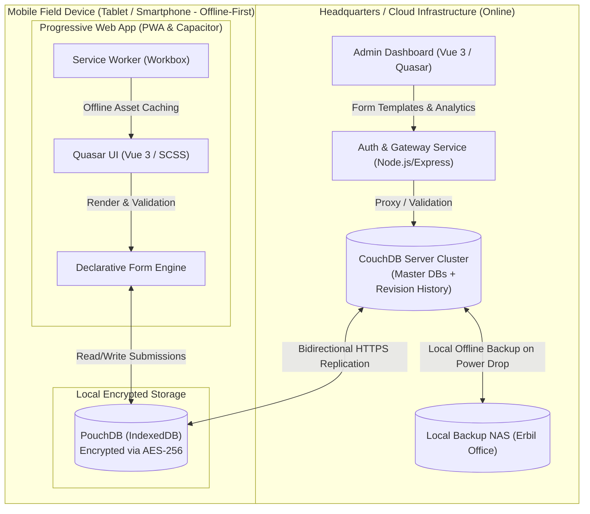
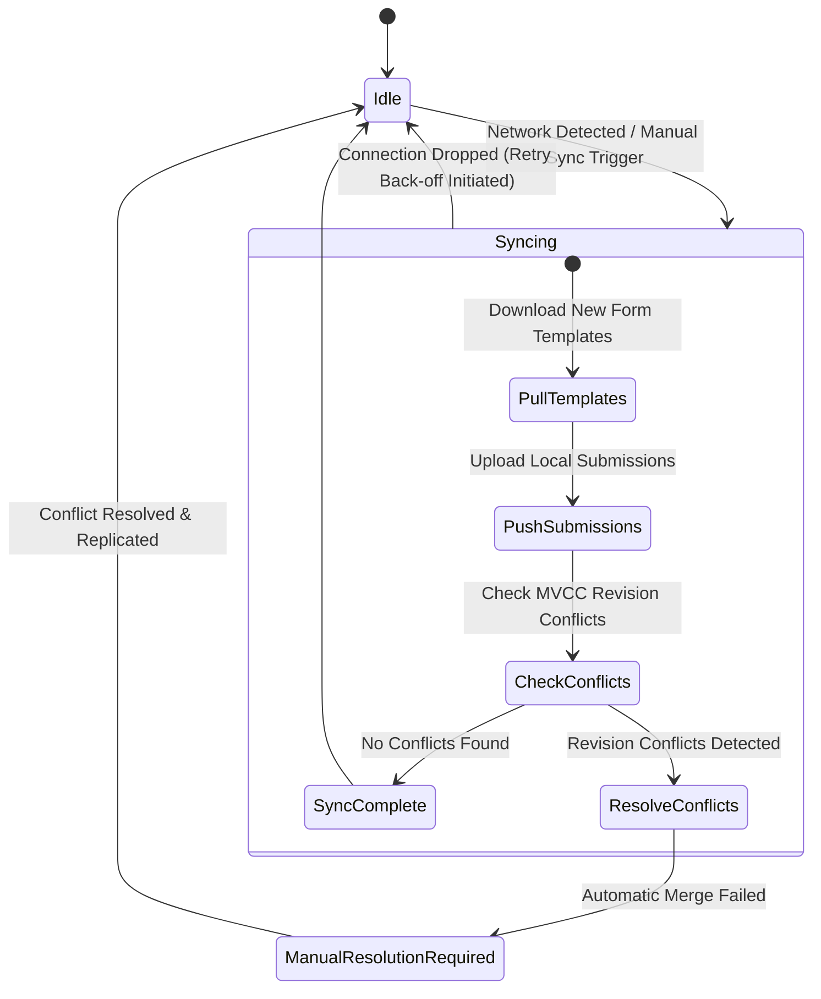

# Technical Architecture Specification & System Design: Offline-First Low-Code Platform for NGOs in Kurdistan (HumanitySync)

This document defines the detailed system design and technical architecture for **HumanitySync**, an offline-first low-code data collection platform designed for NGOs. The architecture is specifically tailored to address the infrastructural challenges in the Kurdistan Region of Iraq (KRI) and similar crisis or development contexts (frequent power grid switches, "Ampere switch" power interruptions, high cellular data costs, and remote field deployments without network coverage).

---

## 1. System Architecture & Data Flow

The platform strictly decouples the administrative and template definition system (Online in headquarters or cloud) from the execution components (Offline-capable on mobile field devices).

### 1.1 High-Level Architecture Diagram



### 1.2 Data Flow Scenarios

#### Scenario A: Office Preparation & Template Synchronization (Online)
1. The project manager creates a new form template (JSON format) in the **Admin Dashboard**.
2. The template is stored in CouchDB under the document ID `template:survey_winter_2026`.
3. The field worker launches the app at headquarters over Wi-Fi.
4. PouchDB initiates replication and downloads all assigned form templates into local storage.
5. The Service Worker caches all static web assets (HTML, JS, CSS, fonts).

#### Scenario B: Field Data Capture (Offline)
1. The field worker travels to a remote site (e.g., Camp Alpha) and switches the device to offline / airplane mode.
2. The PWA boots directly from the Service Worker cache.
3. The **Declarative Form Engine** fetches the JSON form definition from local PouchDB and renders the dynamic form interface.
4. Every input change is automatically saved to local storage via draft auto-save.
5. Upon tapping "Save Submission", the document is written as `submission:survey_winter_2026:<UUID>` with `sync_state.synced = false`.

#### Scenario C: Data Synchronization & Conflict Resolution (Online Recovery)
1. As soon as the app detects network connectivity (via `navigator.onLine` and active HTTP heartbeats), the PouchDB replication process kicks in.
2. Unconflicted records are synced directly to CouchDB.
3. If an identical record was edited concurrently by multiple field staff while offline, CouchDB MVCC revision conflicts (`_conflicts`) are created.
4. Conflicts are visually inspected and merged via the **Conflict Resolver** UI or the Admin Dashboard.

---

## 2. Data Models & JSON Specifications

All data in HumanitySync is stored as structured JSON documents. The core specifications are defined below.

### 2.1 Form Template Schema (`FormTemplate`)

Form templates declaratively define form fields, validation constraints, and conditional display rules.

```json
{
  "_id": "template:needs_assessment_v1",
  "type": "template",
  "version": 1,
  "title": "Needs Assessment Camp Alpha (Winter 2026)",
  "metadata": {
    "created_at": "2026-06-14T18:00:00Z",
    "author": "project_manager@ngo.org",
    "target_region": "Region Alpha"
  },
  "fields": [
    {
      "id": "family_head_name",
      "type": "text",
      "label": "Name of Family Head",
      "required": true,
      "validation": {
        "min_length": 3,
        "max_length": 100
      }
    },
    {
      "id": "family_size",
      "type": "number",
      "label": "Number of Family Members",
      "required": true,
      "validation": {
        "min": 1,
        "max": 30
      }
    },
    {
      "id": "has_infants",
      "type": "boolean",
      "label": "Are there infants/toddlers (0-2 years)?",
      "required": true
    },
    {
      "id": "infant_food_required",
      "type": "boolean",
      "label": "Baby food/formula required?",
      "conditions": [
        {
          "field": "has_infants",
          "operator": "equals",
          "value": true
        }
      ]
    },
    {
      "id": "shelter_condition",
      "type": "select",
      "label": "Shelter Condition",
      "required": true,
      "options": [
        { "value": "good", "label": "Good (Dry, windproof)" },
        { "value": "damaged", "label": "Damaged (Torn canvas)" },
        { "value": "critical", "label": "Critical (No protection from rain/cold)" }
      ]
    }
  ]
}
```

### 2.2 Form Submission Schema (`FormSubmission`)

Each completed survey creates a submission document storing beneficiary answers, field metadata, and replication state.

```json
{
  "_id": "submission:needs_assessment_v1:7f9b8c2d-4e92-4a92-bd12-88f11cbaef83",
  "_rev": "1-a1b2c3d4e5f6g7h8",
  "type": "submission",
  "template_id": "template:needs_assessment_v1",
  "status": "completed",
  "sync_state": {
    "synced": false,
    "last_attempt": "2026-06-14T19:30:12Z",
    "device_id": "tablet_field_04"
  },
  "metadata": {
    "surveyor_id": "user:surveyor_alpha",
    "created_at": "2026-06-14T19:15:00Z",
    "updated_at": "2026-06-14T19:28:45Z",
    "location": {
      "latitude": 36.2167,
      "longitude": 44.0167,
      "accuracy_meters": 8.5
    }
  },
  "data": {
    "family_head_name": "Alex Morgan",
    "family_size": 6,
    "has_infants": true,
    "infant_food_required": true,
    "shelter_condition": "damaged"
  }
}
```

---

## 3. Synchronization & Replication Strategy

Data synchronization relies on the CouchDB replication protocol supported natively by PouchDB.

### 3.1 Synchronization Lifecycle

The sync manager handles network detection, upload/download phases, and back-off retries:



### 3.2 Sync Manager Architecture

The sync engine uses aggressive exponential back-off retries capped at 10 seconds to handle micro-grid power switches and router reboots without exhausting mobile data quotas.

```typescript
import PouchDB from 'pouchdb';

export interface SyncConfig {
  localDbName: string;
  remoteDbUrl: string;
  filterBySurveyor?: string;
}

export class HumanitySyncManager {
  private localDb: PouchDB.Database;
  private remoteDb: PouchDB.Database;
  private syncHandler: any = null;

  constructor(config: SyncConfig) {
    this.localDb = new PouchDB(config.localDbName);
    this.remoteDb = new PouchDB(config.remoteDbUrl, {
      skip_setup: true,
    });
  }

  /**
   * Starts continuous bidirectional replication with back-off auto-reconnect.
   * Tailored for power grid switches ("Ampere drops") via fast retry ramp-up.
   */
  public startSync(onSyncChange: (info: any) => void, onError: (err: any) => void) {
    if (this.syncHandler) {
      this.syncHandler.cancel();
    }

    this.syncHandler = PouchDB.sync(this.localDb, this.remoteDb, {
      live: true,
      retry: true,
      back_off_function: (delay) => {
        if (delay === 0) return 1000; // Initial 1 second retry
        if (delay < 5000) return delay * 1.5; // Fast ramp-up
        return 10000; // Cap at 10 seconds max pause to conserve bandwidth
      },
      filter: 'app/by_surveyor',
      query_params: { surveyor_id: localStorage.getItem('surveyor_id') }
    })
    .on('change', (info) => onSyncChange(info))
    .on('paused', (err) => {
      console.log('Replication paused (network unreachable or idle)', err);
    })
    .on('active', () => {
      console.log('Replication active');
    })
    .on('error', (err) => onError(err));
  }

  public stopSync() {
    if (this.syncHandler) {
      this.syncHandler.cancel();
    }
  }
}
```

---

## 4. Conflict Resolution

When multiple devices work offline, concurrent edits create revision branches in CouchDB's Multi-Version Concurrency Control (MVCC) tree.

### 4.1 Conflict Detection

Conflicts are detected during querying by requesting `conflicts: true` on PouchDB / CouchDB endpoints.

```typescript
async function getConflictingSubmissions(db: PouchDB.Database) {
  const result = await db.allDocs({
    include_docs: true,
    conflicts: true,
    startkey: 'submission:',
    endkey: 'submission:\ufff0'
  });

  return result.rows
    .filter(row => row.doc && row.doc._conflicts && row.doc._conflicts.length > 0)
    .map(row => row.doc);
}
```

### 4.2 Conflict Resolution Workflow

1. **Auto-Merge (Deterministic):**
   If concurrent edits affect separate, non-overlapping field keys (e.g. Device A edits `family_size`, Device B edits `shelter_condition`), the system merges the fields automatically.
2. **Visual Resolution (Conflict Resolver UI):**
   If the same key contains competing values, the user or project manager is presented with a 3-way visual merge tool in the application.

#### Visual Conflict Resolution Table

| Field Key | Device Revision A (Surveyor 1 - 14:10) | Device Revision B (Surveyor 2 - 14:15) | Selected Value |
| :--- | :--- | :--- | :--- |
| **Shelter Condition** | `damaged` | `critical` | [ ] A  [x] B  [ ] Custom |
| **Family Size** | `5` | `6` | [x] A  [ ] B  [ ] Custom |

#### Resolving Revisions via PouchDB API

```typescript
async function resolveConflict(
  db: PouchDB.Database,
  resolvedDoc: any,
  conflictingRevs: string[]
) {
  // 1. Save the merged winning document
  await db.put(resolvedDoc);

  // 2. Remove losing conflict revisions to prune the revision tree
  for (const rev of conflictingRevs) {
    await db.remove(resolvedDoc._id, rev);
  }
}
```

---

## 5. Security & Offline Data Privacy

In humanitarian contexts, protecting beneficiary privacy and sensitive indicators is critical.

### 5.1 Client-Side Encryption at Rest

Submission answers stored in IndexedDB are encrypted client-side.
* **Algorithm:** AES-256 using CryptoJS / Web Crypto API.
* **Key Management:** The encryption key is derived in memory from user credentials (PIN/password + salt via PBKDF2) and is **never** written to local disk or LocalStorage.

```typescript
import CryptoJS from 'crypto-js';

export class EncryptedPouchWrapper {
  private db: PouchDB.Database;
  private encryptionKey: string;

  constructor(dbName: string, key: string) {
    this.db = new PouchDB(dbName);
    this.encryptionKey = key;
  }

  public async putEncrypted(doc: any) {
    const { _id, _rev, type, metadata, ...sensitiveData } = doc;
    
    // Encrypt sensitive answer payload while leaving metadata readable for sync filters
    const ciphertext = CryptoJS.AES.encrypt(
      JSON.stringify(sensitiveData),
      this.encryptionKey
    ).toString();

    return this.db.put({
      _id,
      _rev,
      type,
      metadata,
      encrypted_payload: ciphertext
    });
  }

  public async getDecrypted(id: string): Promise<any> {
    const doc: any = await this.db.get(id);
    if (!doc.encrypted_payload) return doc;

    const bytes = CryptoJS.AES.decrypt(doc.encrypted_payload, this.encryptionKey);
    const decryptedData = JSON.parse(bytes.toString(CryptoJS.enc.Utf8));

    return {
      _id: doc._id,
      _rev: doc._rev,
      type: doc.type,
      metadata: doc.metadata,
      ...decryptedData
    };
  }
}
```

### 5.2 Document-Level Security (In-Transit Filtering)

CouchDB design documents enforce replication filters so field staff only receive documents relevant to their account.

```javascript
{
  "_id": "_design/app",
  "filters": {
    "by_surveyor": "function(doc, req) {
      // Always sync system templates
      if (doc.type === 'template') {
        return true;
      }
      // Sync submissions only if created by the requesting surveyor
      if (doc.type === 'submission') {
        return doc.metadata && doc.metadata.surveyor_id === req.query.surveyor_id;
      }
      return false;
    }"
  }
}
```

---

## 6. PWA & Service Worker Caching

Full offline independence is guaranteed by a Workbox Service Worker.

### 6.1 Caching Strategies

1. **Static Assets (HTML, JS, CSS, Fonts):**
   * *Strategy:* **Cache-First (Stale-While-Revalidate)**
   * *Rationale:* Ensures instant boot under zero connectivity. Updates compile in the background for the next session.
2. **API Endpoints (Authentication & Health Pings):**
   * *Strategy:* **Network-Only** (with graceful offline status fallback).
3. **Fallback Form Templates:**
   * Primary templates load from PouchDB; bundled fallback definitions serve as an offline backup.

### 6.2 Workbox Configuration (`sw.ts`)

```typescript
import { registerRoute } from 'workbox-routing';
import { StaleWhileRevalidate, CacheFirst, NetworkOnly } from 'workbox-strategies';
import { ExpirationPlugin } from 'workbox-expiration';
import { precacheAndRoute } from 'workbox-precaching';

declare const self: ServiceWorkerGlobalScope;

precacheAndRoute(self.__WB_MANIFEST);

// Cache-First for web fonts
registerRoute(
  ({ url }) => url.origin === 'https://fonts.googleapis.com' || url.origin === 'https://fonts.gstatic.com',
  new CacheFirst({
    cacheName: 'google-fonts',
    plugins: [
      new ExpirationPlugin({ maxEntries: 10, maxAgeSeconds: 60 * 60 * 24 * 30 }),
    ],
  })
);

// Stale-While-Revalidate for application assets
registerRoute(
  ({ request }) => request.destination === 'image' || request.destination === 'font',
  new StaleWhileRevalidate({
    cacheName: 'app-assets',
  })
);

// Network-Only for API auth
registerRoute(
  ({ url }) => url.pathname.startsWith('/api/auth'),
  new NetworkOnly()
);
```

---

## 7. Infrastructure & Deployment (Docker Stack)

The multi-container Docker stack is lightweight and runs on cloud VPS servers or local edge hardware (e.g. Synology NAS, Intel NUC) in field offices.

```yaml
version: '3.8'

services:
  couchdb:
    image: couchdb:3.3.2
    container_name: humanitysync_couchdb
    environment:
      - COUCHDB_USER=${COUCHDB_USER:-admin}
      - COUCHDB_PASSWORD=${COUCHDB_PASSWORD:-adminpassword}
    volumes:
      - couchdb_data:/opt/couchdb/data
      - ./couchdb/local.ini:/opt/couchdb/etc/local.d/local.ini
    ports:
      - "${COUCHDB_PORT:-5984}:5984"
    networks:
      - humanitysync_net
    restart: unless-stopped

  gateway:
    image: node:18-alpine
    container_name: humanitysync_gateway
    working_dir: /app
    volumes:
      - ./gateway:/app
    command: npm run start
    environment:
      - COUCHDB_URL=http://${COUCHDB_USER:-admin}:${COUCHDB_PASSWORD:-adminpassword}@couchdb:5984
      - JWT_SECRET=${JWT_SECRET}
      - PORT=3000
    ports:
      - "3000:3000"
    depends_on:
      - couchdb
    networks:
      - humanitysync_net
    restart: unless-stopped

  nginx:
    image: nginx:stable-alpine
    container_name: humanitysync_nginx
    ports:
      - "${NGINX_PORT:-8080}:80"
    volumes:
      - ./nginx/nginx.conf:/etc/nginx/nginx.conf:ro
      - ./frontend/dist/spa:/usr/share/nginx/html:ro
    depends_on:
      - gateway
    networks:
      - humanitysync_net
    restart: unless-stopped

networks:
  humanitysync_net:
    driver: bridge

volumes:
  couchdb_data:
    driver: local
```

---

## 8. Verification & Quality Assurance

### 8.1 Automated Verification
* **Unit Tests (Vitest/Jest):**
  * Form Engine conditional field rendering and validation bounds.
  * AES-256 payload encryption/decryption roundtrip tests.
* **Type Safety & Linting:**
  * ESLint strict TypeScript flat config.
  * Vue 3 TypeScript compilation (`vue-tsc`).

### 8.2 Manual Field Testing
1. **Power Drop & Router Switch Test:**
   * Open form engine and input survey data.
   * Simulate a power grid outage ("Ampere drop") by disabling connection.
   * *Expected result:* UI remains fully responsive; input buffer auto-saves without data loss.
2. **Offline Data Sync Verification:**
   * Capture 50 survey submissions in offline mode.
   * Connect to network and monitor CouchDB replication logs.
   * *Expected result:* All 50 records upload cleanly to CouchDB with intact AES ciphertexts.
